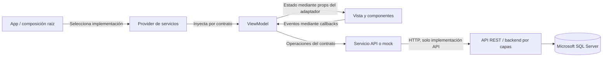
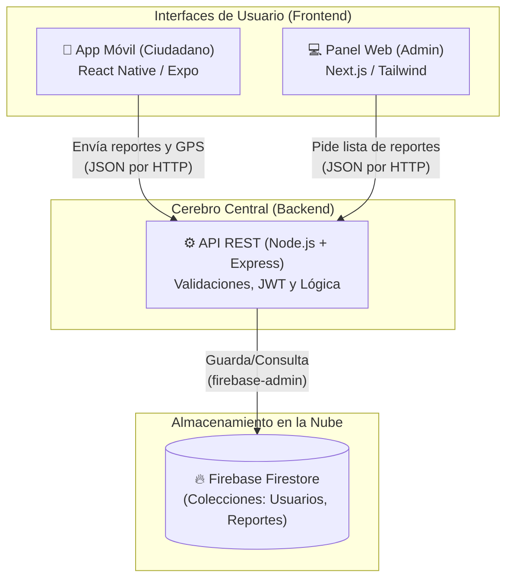
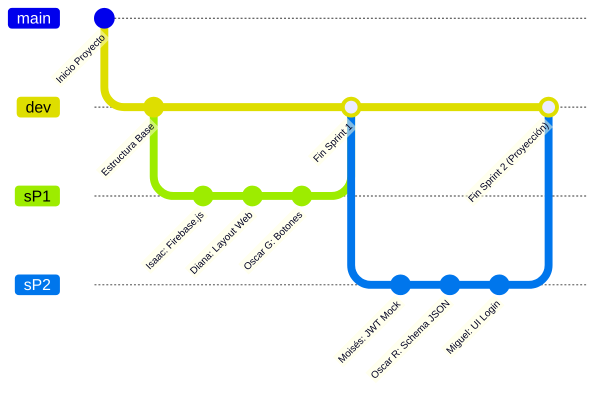

# 🏙️ Mejora SJR - Plataforma de Reportes Ciudadanos

**Mejora San Juan del Río** es un sistema integral compuesto por una Aplicación Móvil para ciudadanos y un Panel Administrativo Web para funcionarios del ayuntamiento, respaldado por un servidor escalable.

## Arquitectura vigente

El proyecto se reinició con estas decisiones: frontend móvil con **React Native, MVVM, SOLID e inyección de dependencias**, backend con **arquitectura por capas** y **Microsoft SQL Server** como base de datos. La comunicación entre clientes y backend será mediante una **API RESTful**. El móvil no se conectará directamente a SQL Server.

Firebase y CQRS no forman parte de la arquitectura vigente. La navegación móvil utiliza **React Navigation Native Stack**, con un `AppRouter.tsx`; ya no utiliza Expo Router ni rutas basadas en archivos.

## Frontend móvil: estructura y funcionamiento

El código móvil vive en [`mejora-sjr-mobile/`](./mejora-sjr-mobile/). La HU-05 implementa la entrada de la aplicación y el recorrido entre acceso e inicio. Para ejecutar el proyecto y consultar los pasos de validación, ver el [README móvil](./mejora-sjr-mobile/README.md).

### Estructura de carpetas

```text
mejora-sjr-mobile/
├── index.ts                         # Registra la aplicación con Expo
├── App.tsx                          # Composición raíz y proveedores generales
├── app.json                         # Configuración de Expo, iconos y splash
├── assets/                          # Recursos estáticos de la aplicación
└── src/
    ├── navigation/
    │   └── AppRouter.tsx            # Stack, tipos de rutas y adaptadores
    ├── views/
    │   ├── LoginView.tsx            # Interfaz de acceso
    │   ├── HomeView.tsx             # Interfaz de inicio
    │   └── ReportesView.tsx         # Lista, carga, error y reintento
    ├── viewModels/
    │   ├── useLoginViewModel.ts     # Acciones de la pantalla de acceso
    │   ├── useHomeViewModel.ts      # Acciones de la pantalla de inicio
    │   └── useReportesViewModel.ts  # Estado y consulta de reportes
    ├── models/                     # Tipos y modelos de dominio
    ├── services/
    │   ├── contracts/              # Interfaces de servicios
    │   ├── api/                    # Implementaciones HTTP
    │   ├── mocks/                  # Implementaciones simuladas
    │   └── storage/                # Implementación de almacenamiento de tokens
    ├── providers/                  # Contextos e inyección de dependencias
    ├── components/                 # UI reutilizable
    └── constants/                  # Valores compartidos
```

Las carpetas todavía sin implementación contienen `.gitkeep` para que Git conserve la estructura. Ya existen servicios HTTP y un modelo mínimo de reporte; la autenticación sigue pendiente.

### Responsabilidad de cada carpeta

| Carpeta | Qué contendrá y cómo se utilizará | Límites |
|---|---|---|
| `navigation/` | Define las rutas, sus parámetros y el Stack. Sus adaptadores conectan cada ViewModel con su Vista y traducen callbacks a acciones de navegación. Actualmente esto vive en `AppRouter.tsx`. | No valida formularios ni realiza peticiones. No entrega el objeto completo de navegación a la Vista. |
| `views/` | Pantallas completas que dibujan UI nativa a partir de props y emiten eventos mediante callbacks. Por ejemplo, `LoginView` recibe `onContinue`. | Sin llamadas HTTP, lógica de negocio ni estado complejo. El estado y los efectos se delegan al ViewModel. |
| `viewModels/` | Custom hooks que administrarán campos, validaciones de presentación, carga, errores y acciones. Exponen únicamente los datos y operaciones necesarios para la UI. | No dibujan JSX ni importan `fetch`, `axios` o implementaciones concretas de servicios. |
| `models/` | Tipos y modelos de dominio, como un futuro `Reporte` o `Usuario`. Permiten compartir la forma de los datos entre servicios y ViewModels. | No contienen componentes, hooks, peticiones ni conexiones a la base de datos. No representan obligatoriamente las tablas SQL. |
| `services/contracts/` | Interfaces pequeñas según la capacidad requerida, por ejemplo un futuro contrato de consulta de reportes. Son las abstracciones de las que dependerán los ViewModels. | No contienen implementaciones HTTP ni obligan a consumir métodos ajenos al caso de uso. |
| `services/api/` | Implementaciones de los contratos que llaman a la API REST, procesan respuestas y adaptan datos o errores para el móvil. | Aquí se encapsula la librería HTTP. No manejan estado visual ni navegación. |
| `services/mocks/` | Implementaciones simuladas de los mismos contratos, con datos controlados para desarrollar y probar sin depender del servidor. | Deben respetar el contrato y ser sustituibles por la implementación real. No se simulan peticiones dentro de las Vistas. |
| `providers/` | Proveedores de contexto que suministrarán servicios a los adaptadores o ViewModels. La composición raíz seleccionará las implementaciones concretas. | No concentran la lógica de todas las pantallas ni crean una nueva instancia del servicio en cada render. |
| `components/` | Piezas visuales reutilizables, como botones, campos controlados o tarjetas. Las Vistas las combinarán para construir pantallas. | Reciben props mínimas: por ejemplo, `title`, `disabled` y `onPress`; no un usuario, servicio o ViewModel completo si no lo necesitan. |
| `constants/` | Valores compartidos realmente utilizados, como colores, espaciados o límites de presentación. | Sin estado mutable, lógica de negocio ni credenciales. Las reglas del servidor no se sustituyen por constantes del cliente. |

No existe una carpeta genérica `hooks/` en esta base: los hooks que gestionan estado y acciones de presentación pertenecen a `viewModels/`. `navigation/` sustituye la responsabilidad de navegación que antes tenía `src/app/` con Expo Router.

### Cómo arranca y navega la aplicación actual

1. `package.json` señala a `index.ts` como entrada. Este registra `App` mediante Expo.
2. `App.tsx` monta el proveedor de áreas seguras, la barra de estado y `AppRouter`.
3. `AppRouter.tsx` contiene un único `NavigationContainer` y un Stack tipado con `Login`, `Home` y `Reportes`, sin parámetros de ruta. La ruta inicial es `Login`.
4. El adaptador `LoginScreen` conecta `useLoginViewModel` con `LoginView`, pasando únicamente `onContinue`.
5. Al pulsar **Explorar inicio**, el callback ejecuta `navigation.navigate('Home')`.
6. En Home, **Volver al acceso** ejecuta el callback del ViewModel, conectado a `navigation.popToTop()`. También está disponible el retroceso del Stack.

Los ViewModels de Login y Home solo exponen callbacks. El nuevo `useReportesViewModel`
consulta `/reportes` mediante un servicio HTTP inyectado por parámetro y expone carga,
datos, error y recarga. Desde Home se abre la ruta `Reportes`; su adaptador pasa props
explícitas a `ReportesView`, sin entregarle servicios. `App.tsx` crea la instancia real
de `ApiService`. Acceder a Home no significa que exista un usuario autenticado.

El formato `{ success, data }` corresponde al controlador actual del backend. El modelo
`Reporte` respeta el contrato confirmado (`IdReporte`, `Titulo`, `Descripcion`, ubicación,
IDs y fechas). El ViewModel lo transforma a `id`, `titulo`, `descripcion` y `estado` para
la Vista. Ver [contrato y pruebas del listado](./mejora-sjr-mobile/README.md#consulta-de-reportes-con-mvvm-e-inyección-por-parámetro).

### Cómo funcionará MVVM con servicios

El siguiente flujo describe la organización de los servicios. El listado de reportes
ya usa inyección directa desde la composición raíz; un Provider de contexto es opcional:



Por ejemplo, al implementar una consulta de reportes, el ViewModel activará el estado de carga y llamará al servicio inyectado. El servicio devolverá los datos o un error; el ViewModel actualizará el estado y el adaptador entregará a la Vista las props necesarias para mostrar la lista, el indicador de carga o el mensaje de error. El backend conservará la responsabilidad de autorización y validación de negocio.

La inyección podrá realizarse por parámetro o contexto. Un parámetro llamado `apiService` deberá estar tipado con una **interfaz**, no con una clase concreta. La implementación se creará en la composición raíz o en un proveedor y podrá cambiar entre API y mock sin modificar la Vista ni el ViewModel. No es obligatorio crear un proveedor para una dependencia que se resuelva de forma sencilla por parámetro.

### Reglas para añadir una funcionalidad

1. Definir los tipos necesarios en `models/` y, si requiere datos externos, un contrato específico en `services/contracts/`.
2. Implementar el contrato en `services/mocks/` o `services/api/`, según la etapa de integración.
3. Crear el hook en `viewModels/` e inyectarle el servicio. Mantener ahí el estado, las validaciones de presentación y las acciones.
4. Construir la Vista en `views/` con props explícitas y reutilizar piezas de `components/` cuando corresponda.
5. Conectar Vista, ViewModel y dependencias mediante el adaptador, y registrar la ruta en `navigation/` si es una pantalla nueva.
6. Comprobar tipos, estados de carga y error, navegación y sustitución del servicio por un mock cuando aplique.

Estas reglas aplican **SRP** al separar interfaz, estado y acceso a datos; **ISP** al mantener props y contratos pequeños; y **DIP** al hacer que los ViewModels dependan de abstracciones inyectadas. No se crean servicios o modelos ficticios para una pantalla que solo necesita navegación.

---

## Archivo histórico de la versión anterior

> El contenido siguiente se conserva como antecedente del proyecto previo al reinicio. Sus referencias a Firebase, Firestore, Expo Router, archivos retirados y sprints anteriores **no describen la implementación ni las decisiones vigentes**. Para el frontend móvil actual, utilizar la sección anterior y el README móvil enlazado.

---

## 🚀 Documentación del Sprint 1: Inicialización y Base del Sistema

Durante este Sprint, el equipo se dividió el trabajo estratégicamente para inicializar las bases del proyecto sin causar colisiones en el código. A continuación se documenta qué código agregó cada integrante según su Historia de Usuario (US):

### 1. Backend: Conexión Segura a Firebase (Por: Isaac)
* **Historia de Usuario:** Configuración de la base de datos en la nube.
* **Archivo agregado:** `mejora-sjr-backend/src/config/firebase.js`
* **Explicación del código:** 
  Isaac programó el puente de comunicación entre el servidor Node.js y Google Firebase. Utilizó `firebase-admin` para cargar de forma segura las credenciales (desde un archivo JSON de servicio) y exportó la instancia de `firestore`. Esto permite que el resto del equipo pueda hacer consultas a la base de datos importando este único archivo.

### 2. Backend: Servidor Express y CORS (Por: Moisés)
* **Historia de Usuario:** Creación del motor principal del servidor.
* **Archivos agregados:** `mejora-sjr-backend/src/index.js` (y rutas base)
* **Explicación del código:**
  Moisés inicializó la estructura del servidor usando el framework `Express`. Configuró variables de entorno con `dotenv` para ocultar puertos sensibles, y habilitó `CORS` para asegurar que las peticiones web y móviles no sean bloqueadas por seguridad de los navegadores. Levantó la API para escuchar en el puerto local.

### 3. Panel Web Admin: Pantalla de Login (Por: Diana)
* **Historia de Usuario (US5):** Interfaz de acceso para el personal del Ayuntamiento.
* **Archivo modificado:** `mejora-sjr-admin/src/app/page.tsx`
* **Explicación del código:**
  Diana implementó un diseño avanzado (nivel Senior) con *Glassmorphism* usando Tailwind CSS en Next.js. Creó un formulario interactivo con soporte para modo oscuro, validaciones del formato de correo (con expresiones regulares) y un simulador asíncrono de carga ("Validando credenciales...") que gestiona estados de éxito y error visualmente.

### 4. App Móvil: Sistema de Navegación (Por: Miguel)
* **Historia de Usuario:** Rutas principales de la app ciudadana.
* **Archivos agregados:** `mejora-sjr-mobile/src/app/_layout.tsx` y `index.tsx`
* **Explicación del código:**
  Miguel implementó `Expo Router`, la tecnología de navegación moderna basada en archivos (similar a Next.js). Creó el Stack Navigator principal que actuará como la estructura ósea de la app, y configuró la pantalla inicial limpia que dice "Bienvenido a Mejora SJR", lista para que se le inserten botones e imágenes.

### 5. Base de Datos: Arquitectura NoSQL (Por: Oscar Rivera)
* **Historia de Usuario:** Definición de la estructura de datos.
* **Explicación del código:**
  Rivera fungió como el Arquitecto de Datos. Su labor principal fue diseñar en formato JSON cómo se guardará la información ciudadana (Usuarios, Reportes, Coordenadas GPS, Fotografías) dentro de colecciones y documentos en Firestore, optimizando la lectura para que el sistema sea rápido y barato de mantener.

### 6. App Móvil: Librería de Interfaz Visual UI (Por: Oscar Granados)
* **Historia de Usuario:** Componentes de diseño estandarizados.
* **Archivos agregados:** `mejora-sjr-mobile/components/CustomButton.tsx` y `CustomInput.tsx`
* **Explicación del código:**
  Granados programó las piezas visuales ("Lego") de la app. Creó un botón táctil con animaciones y sombras (`TouchableOpacity`), y un campo de texto moderno (`TextInput`) para formularios. Ambos componentes son dinámicos a través de *Props* de TypeScript, lo que significa que el equipo de frontend puede reutilizarlos en cualquier pantalla con una sola línea de código sin tener que volver a diseñarlos.

---

> **Nota para el equipo:** El código fue integrado de forma exitosa mediante la rama `sP1` y fusionado a `dev`. Todas las configuraciones están funcionales y estables.

# 🏗️ Arquitectura y Flujo de Trabajo - Mejora SJR

Basado en la estructura de tu proyecto y en la conversación estratégica del PDF para el **Sprint 2**, aquí tienes el análisis completo de cómo se conecta todo el ecosistema, dónde vive la información y cómo se organizan las ramas en GitHub.

---

## 1. Esquema de Conexiones (Arquitectura)

El sistema está diseñado con una arquitectura cliente-servidor desacoplada. Ningún frontend habla directamente con la base de datos; todo pasa por el servidor central por seguridad.



### ¿Cómo se comunican?
- **El Celular (App Móvil):** Cuando un ciudadano toma una foto de un bache, la app móvil agrupa esa foto, las coordenadas GPS y el texto en un paquete (JSON) y se lo envía al Backend (API) a través de una petición HTTP (usualmente a un puerto como `localhost:3000` o la URL de producción).
- **El Servidor (Backend):** Recibe el paquete, Moisés valida que el token sea seguro, Isaac revisa que los datos no vengan vacíos, y si todo está bien, se conecta a Firebase.
- **La Nube (Firebase):** Guarda permanentemente la información en las colecciones diseñadas por Oscar R.
- **La Computadora (Panel Web):** Cuando el administrador entra a la web maquetada por Diana, la página le pide al Backend todos los reportes, y el Backend los trae de Firebase para mostrarlos en pantalla.

---

## 2. Organización de las Carpetas

El repositorio está dividido en 3 grandes "Mundos" que viven en la misma carpeta raíz pero no se mezclan entre sí:

*   📱 **`mejora-sjr-mobile/`**: Aquí trabajan **Miguel** (diseño de pantallas) y **Oscar Granados** (lógica y botones). Es el código que terminará instalado en los celulares de la gente.
*   💻 **`mejora-sjr-admin/`**: Aquí trabaja **Diana**. Es el código de la página web exclusiva para los trabajadores del municipio.
*   ⚙️ **`mejora-sjr-backend/`**: Aquí trabajan **Isaac** (servicios), **Moisés** (seguridad y servidor base) y **Oscar Rivera** (arquitectura de datos). Es el código invisible que procesa toda la información.

---

## 3. Estrategia de Ramificaciones en GitHub (El Flujo Asíncrono)

De acuerdo a la estrategia que plantearon, su equipo utiliza un modelo de trabajo **desacoplado y asíncrono**. Esto significa que nadie tiene que esperar a que el otro termine para empezar a trabajar.



### ¿Cómo se trabajará en el Sprint 2 (`sP2`)?
1. **La Regla de Oro:** "Crea tu módulo aislado y usa datos falsos (Mocks) por ahora".
2. **Archivos Separados:** Cada programador va a crear **un archivo nuevo que no existía antes**. Por ejemplo, Isaac creará `authService.js` y Moisés `jwtUtil.js`. Como están tocando archivos diferentes, cuando suban su código a GitHub en la rama `sP2`, **no habrá colisiones de código** (merge conflicts).
3. **Datos Simulados (Mocks):** Para que Miguel pueda probar si su pantalla funciona, Oscar Granados le pasará un "Custom Hook" que finge conectarse a internet e imprime un texto de éxito. Nadie detiene a nadie.
4. **La Integración Final:** Cuando termine la semana, tú (como líder) revisarás que todos los archivos estén en `sP2`. Luego, bajarás todo y harás el `git merge` hacia `dev` (justo como hicimos hoy con el Sprint 1). Será hasta el **Sprint 3** donde conectarán los cables reales para que la app hable con la base de datos de verdad.

---

# 🗄️ Esquema de Base de Datos — Firebase Firestore
### Proyecto: Mejora SJR · Sistema de Reportes Urbanos Ciudadanos
> **Rama:** `sP1` · **Autor:** Arquitecto de BD NoSQL · **Fecha:** 2026-09-14

---

## Índice
1. [Convenciones generales](#convenciones-generales)
2. [Colección `usuarios`](#colección-usuarios)
3. [Colección `reportes`](#colección-reportes)
4. [Diagrama de relaciones](#diagrama-de-relaciones)
5. [Notas para el equipo backend](#notas-para-el-equipo-backend)

---

## Convenciones generales

| Convención | Detalle |
|---|---|
| IDs de documentos | Generados automáticamente por Firestore (`Auto-ID`) salvo `uid` de autenticación en `usuarios` |
| Nombres de colecciones | `snake_case` en minúsculas |
| Nombres de campos | `camelCase` |
| Timestamps | `Firestore Timestamp` (UTC). **No** usar `string` ni `Date` de JavaScript |
| Referencias | Tipo `reference` de Firestore para vínculos entre colecciones |
| Imágenes/archivos | Se almacenan en **Firebase Storage**; en Firestore se guarda únicamente la URL de descarga |

---

## Colección `usuarios`

### Descripción
Almacena el perfil de cada ciudadano registrado en la plataforma. El `documentId` coincide con el `uid` generado por **Firebase Authentication**.

---

### Ejemplo de documento JSON

```json
{
  "uid": "aB3kL9mNpQ2rT5vX",
  "nombre": "María Fernanda López",
  "correo": "mfernanda.lopez@email.com",
  "telefono": "+52 477 123 4567",
  "rol": "ciudadano",
  "fotoPerfil": "https://firebasestorage.googleapis.com/v0/.../usuarios/aB3kL9mNpQ2rT5vX/perfil.jpg",
  "activo": true,
  "fechaRegistro": "2026-03-10T09:15:00Z",
  "ultimoAcceso": "2026-09-14T16:02:00Z"
}
```

---

### Tabla de campos

| Campo | Tipo de dato | Descripción breve |
|---|---|---|
| `uid` | `string` | UID de Firebase Authentication. También es el `documentId` del documento |
| `nombre` | `string` | Nombre completo del ciudadano |
| `correo` | `string` | Correo electrónico único, verificado vía Firebase Auth |
| `telefono` | `string` | Número de contacto en formato E.164 (`+52 477 …`) |
| `rol` | `string` | Perfil de acceso: `"ciudadano"`, `"moderador"` o `"admin"` |
| `fotoPerfil` | `string` | URL de descarga de la imagen almacenada en Firebase Storage |
| `activo` | `boolean` | Indica si la cuenta está habilitada (`true`) o suspendida (`false`) |
| `fechaRegistro` | `timestamp` | Momento en que el usuario completó el registro por primera vez |
| `ultimoAcceso` | `timestamp` | Fecha y hora del último inicio de sesión exitoso |

> **Valores permitidos para `rol`**
> - `"ciudadano"` — usuario estándar, puede crear y consultar sus propios reportes.
> - `"moderador"` — puede actualizar el estado de cualquier reporte.
> - `"admin"` — acceso completo a la plataforma y configuración.

---

## Colección `reportes`

### Descripción
Almacena cada incidencia urbana enviada por un ciudadano. El `documentId` es generado automáticamente por Firestore. La referencia al usuario se mantiene tanto como `reference` (para queries relacionales) como como `string` (`uidUsuario`) para facilitar lecturas rápidas sin resolver referencias.

---

### Ejemplo de documento JSON

```json
{
  "id": "7rFkP2qZnX1mWv8Y",
  "uidUsuario": "aB3kL9mNpQ2rT5vX",
  "refUsuario": "usuarios/aB3kL9mNpQ2rT5vX",
  "categoria": "alumbrado_publico",
  "subcategoria": "luminaria_apagada",
  "descripcion": "La lámpara del poste frente al parque lleva 5 días apagada. Genera inseguridad por la noche.",
  "estado": "en_revision",
  "prioridad": "media",
  "ubicacion": {
    "geopoint": { "_latitude": 21.1234, "_longitude": -101.6789 },
    "direccion": "Calle Morelos 45, Col. Centro, San José de Río, GTO",
    "referencia": "Frente al Parque Principal"
  },
  "evidencias": [
    "https://firebasestorage.googleapis.com/v0/.../reportes/7rFkP2qZnX1mWv8Y/foto_01.jpg",
    "https://firebasestorage.googleapis.com/v0/.../reportes/7rFkP2qZnX1mWv8Y/foto_02.jpg"
  ],
  "comentarioModerador": "Se notificó a la dependencia de servicios públicos.",
  "fechaCreacion": "2026-09-12T11:30:00Z",
  "fechaActualizacion": "2026-09-14T08:45:00Z",
  "fechaResolucion": null
}
```

---

### Tabla de campos

| Campo | Tipo de dato | Descripción breve |
|---|---|---|
| `id` | `string` | Auto-ID de Firestore. Se denormaliza dentro del documento para facilitar lecturas |
| `uidUsuario` | `string` | UID del ciudadano que generó el reporte (clave foránea ligera) |
| `refUsuario` | `reference` | Referencia nativa de Firestore al documento en `usuarios/{uid}` |
| `categoria` | `string` | Categoría principal de la incidencia (ver valores permitidos abajo) |
| `subcategoria` | `string` | Clasificación más específica dentro de la categoría |
| `descripcion` | `string` | Texto libre del ciudadano describiendo el problema (máx. 1 000 caracteres) |
| `estado` | `string` | Estado del ciclo de vida del reporte (ver valores permitidos abajo) |
| `prioridad` | `string` | Nivel de urgencia asignado: `"baja"`, `"media"` o `"alta"` |
| `ubicacion` | `map` | Objeto compuesto con la geo-referencia del incidente (ver sub-campos) |
| `ubicacion.geopoint` | `geopoint` | Coordenadas GPS (latitud/longitud) del punto exacto reportado |
| `ubicacion.direccion` | `string` | Dirección textual legible para humanos |
| `ubicacion.referencia` | `string` | Punto de referencia adicional (opcional) |
| `evidencias` | `array<string>` | Lista de URLs de Firebase Storage con las fotos o videos adjuntos |
| `comentarioModerador` | `string` | Nota interna del equipo moderador/admin (puede ser `null`) |
| `fechaCreacion` | `timestamp` | Momento exacto en que el ciudadano envió el reporte |
| `fechaActualizacion` | `timestamp` | Última vez que cualquier campo del documento fue modificado |
| `fechaResolucion` | `timestamp \| null` | Fecha en que el reporte fue marcado como resuelto; `null` si aún está abierto |

---

### Valores permitidos para `categoria`

| Valor | Descripción |
|---|---|
| `"alumbrado_publico"` | Luminarias dañadas, postes caídos, zonas sin luz |
| `"baches_pavimento"` | Hoyos en calles, banquetas deterioradas |
| `"agua_drenaje"` | Fugas, tomas rotas, alcantarillas tapadas |
| `"recoleccion_basura"` | Contenedores llenos, rutas no atendidas |
| `"areas_verdes"` | Parques descuidados, árboles con riesgo de caída |
| `"seguridad_vial"` | Señales dañadas, semáforos sin funcionar |
| `"otro"` | Incidencias que no encajan en las categorías anteriores |

---

### Valores permitidos para `estado`

| Valor | Descripción | Quién puede asignarlo |
|---|---|---|
| `"pendiente"` | Reporte recién enviado, aún no revisado | Sistema (automático al crear) |
| `"en_revision"` | Un moderador tomó el reporte | Moderador / Admin |
| `"en_proceso"` | La dependencia responsable está atendiendo | Moderador / Admin |
| `"resuelto"` | Incidencia corregida y verificada | Moderador / Admin |
| `"rechazado"` | Reporte duplicado, fuera de jurisdicción o inválido | Moderador / Admin |

---

## Diagrama de relaciones

```
┌─────────────────────────┐        ┌──────────────────────────────────────┐
│   usuarios/{uid}        │        │   reportes/{autoId}                  │
│─────────────────────────│        │──────────────────────────────────────│
│ uid            string   │◄───────│ uidUsuario        string             │
│ nombre         string   │        │ refUsuario        reference          │
│ correo         string   │        │ categoria         string             │
│ telefono       string   │        │ subcategoria      string             │
│ rol            string   │        │ descripcion       string             │
│ estado            string             │
│ fotoPerfil     string   │        │ prioridad         string             │
│ activo         boolean  │        │ ubicacion         map                │
│ fechaRegistro  timestamp│        │   ├─ geopoint     geopoint           │
│ ultimoAcceso   timestamp│        │   ├─ direccion    string             │
└─────────────────────────┘        │   └─ referencia   string             │
                                   │ evidencias        array<string>      │
                                   │ comentarioModerador string           │
                                   │ fechaCreacion     timestamp          │
                                   │ fechaActualizacion timestamp         │
                                   │ fechaResolucion   timestamp | null   │
                                   └──────────────────────────────────────┘
```

---

## Notas para el equipo backend

### 🔐 Reglas de seguridad (Firestore Security Rules) — lineamientos

- **`usuarios`**: Solo el propio usuario puede leer/escribir su documento. Los `admin` tienen acceso total.
- **`reportes`**: Cualquier usuario autenticado puede **crear** un reporte. Solo el `moderador` o `admin` puede modificar el campo `estado`. El ciudadano puede actualizar `descripcion` y `evidencias` únicamente si el estado es `"pendiente"`.

### 📌 Índices compuestos recomendados

| Colección | Campos indexados | Orden | Propósito |
|---|---|---|---|
| `reportes` | `estado` + `fechaCreacion` | ASC / DESC | Listar reportes por estado paginados |
| `reportes` | `uidUsuario` + `fechaCreacion` | ASC / DESC | Historial de reportes de un ciudadano |
| `reportes` | `categoria` + `estado` | ASC / ASC | Filtrado por tipo e incidencia activa |
| `reportes` | `ubicacion.geopoint` | — | Consultas geoespaciales con `GeoFirestore` |

### ⚠️ Consideraciones importantes

1. **Límite de Firestore**: Un documento no puede superar **1 MB**. El campo `evidencias` solo almacena URLs, nunca archivos binarios.
2. **Denormalización**: El campo `uidUsuario` (string) se incluye además de `refUsuario` para evitar lecturas adicionales en listados masivos.
3. **Soft delete**: No se elimina físicamente ningún documento. Para usuarios, usar `activo: false`; para reportes, usar `estado: "rechazado"`.
4. **Auditoría**: Los campos `fechaCreacion` y `fechaActualizacion` deben ser escritos exclusivamente desde el backend con `FieldValue.serverTimestamp()`, nunca desde el cliente.
5. **Paginación**: Usar `startAfter(lastDocument)` + `limit(n)` para todas las consultas paginadas sobre `reportes`.

## Validación de inicio de sesión

Se agregó una validación básica para comprobar los datos ingresados por el usuario.
