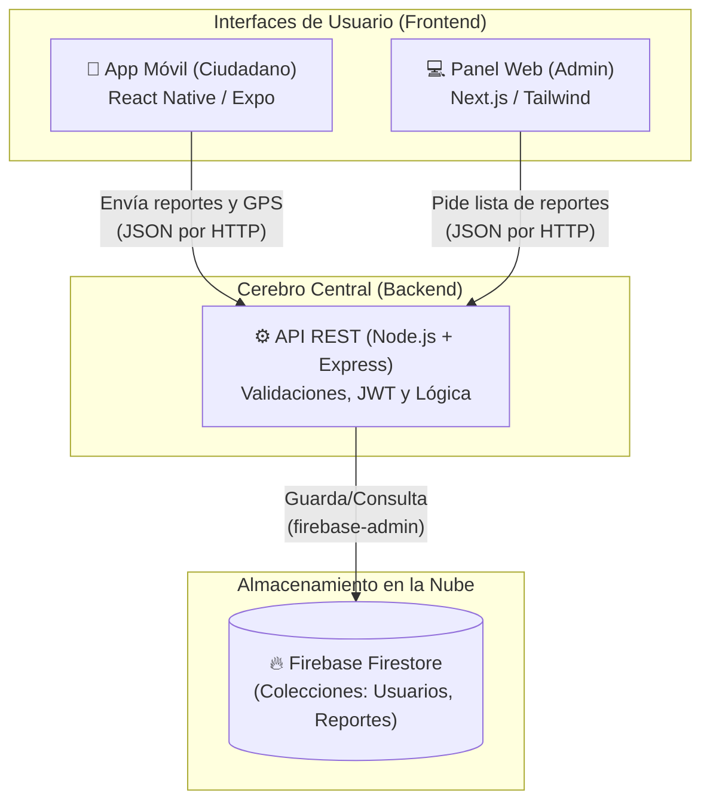
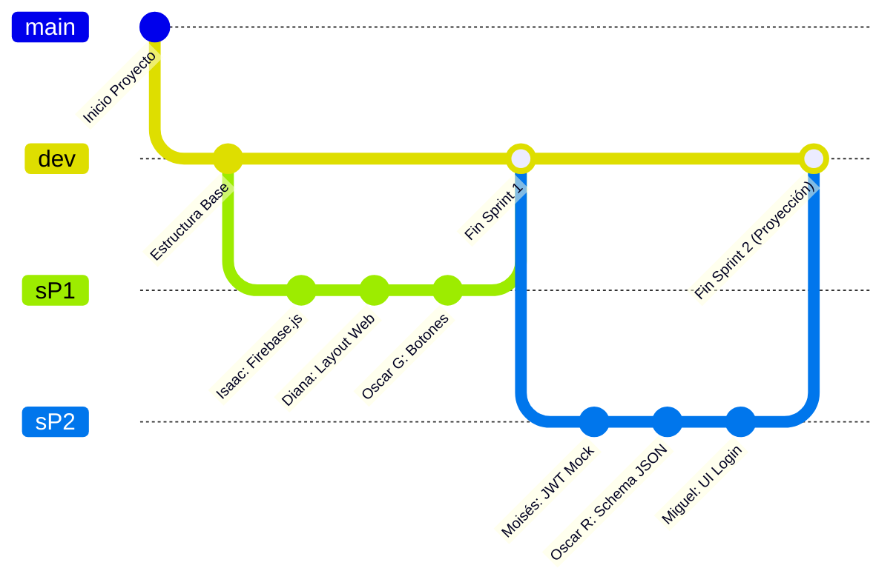

# 🏗️ Arquitectura y Flujo de Trabajo - Mejora SJR

Basado en la estructura de tu proyecto y en la conversación estratégica del PDF para el **Sprint 2**, aquí tienes el análisis completo de cómo se conecta todo el ecosistema, dónde vive la información y cómo se organizan las ramas en GitHub.

---

## 1. Esquema de Conexiones (Arquitectura)

El sistema está diseñado con una arquitectura cliente-servidor desacoplada. Ningún frontend habla directamente con la base de datos; todo pasa por el servidor central por seguridad.

### ¿Cómo se comunican?
- **El Celular (App Móvil):** Cuando un ciudadano toma una foto de un bache, la app móvil agrupa esa foto, las coordenadas GPS y el texto en un paquete (JSON) y se lo envía al Backend (API) a través de una petición HTTP (usualmente a un puerto como `localhost:3000` o la URL de producción).
- **El Servidor (Backend):** Recibe el paquete, Moisés valida que el token sea seguro, Isaac revisa que los datos no vengan vacíos, y si todo está bien, se conecta a Firebase.
- **La Nube (Firebase):** Guarda permanentemente la información en las colecciones diseñadas por Oscar R.
- **La Computadora (Panel Web):** Cuando el administrador entra a la web maquetada por Diana, la página le pide al Backend todos los reportes, y el Backend los trae de Firebase para mostrarlos en pantalla.

---

## 2. Organización de las Carpetas

El repositorio está dividido en 3 grandes "Mundos" que viven en la misma carpeta raíz pero no se mezclan entre sí:

*   📂 **`mejora-sjr-mobile/`**: Aquí trabajan **Miguel** (diseño de pantallas) y **Oscar Granados** (lógica y botones). Es el código que terminará instalado en los celulares de la gente.
*   📂 **`mejora-sjr-admin/`**: Aquí trabaja **Diana**. Es el código de la página web exclusiva para los trabajadores del municipio.
*   📂 **`mejora-sjr-backend/`**: Aquí trabajan **Isaac** (servicios), **Moisés** (seguridad y servidor base) y **Oscar Rivera** (arquitectura de datos). Es el código invisible que procesa toda la información.

---

## 3. Estrategia de Ramificaciones en GitHub (El Flujo Asíncrono)

De acuerdo a la estrategia que plantearon, su equipo utiliza un modelo de trabajo **desacoplado y asíncrono**. Esto significa que nadie tiene que esperar a que el otro termine para empezar a trabajar.

### ¿Cómo se trabajará en el Sprint 2 (`sP2`)?
1. **La Regla de Oro:** "Crea tu módulo aislado y usa datos falsos (Mocks) por ahora".
2. **Archivos Separados:** Cada programador va a crear **un archivo nuevo que no existía antes**. Por ejemplo, Isaac creará `authService.js` y Moisés `jwtUtil.js`. Como están tocando archivos diferentes, cuando suban su código a GitHub en la rama `sP2`, **no habrá colisiones de código** (merge conflicts).
3. **Datos Simulados (Mocks):** Para que Miguel pueda probar si su pantalla funciona, Oscar Granados le pasará un "Custom Hook" que finge conectarse a internet e imprime un texto de éxito. Nadie detiene a nadie.
4. **La Integración Final:** Cuando termine la semana, tú (como líder) revisarás que todos los archivos estén en `sP2`. Luego, bajarás todo y harás el `git merge` hacia `dev` (justo como hicimos hoy con el Sprint 1). Será hasta el **Sprint 3** donde conectarán los cables reales para que la app hable con la base de datos de verdad.
