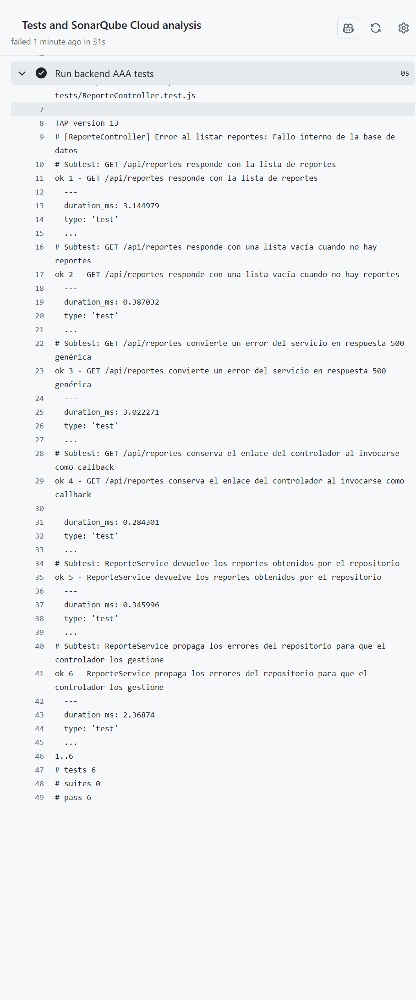

# Práctica: Herramientas de automatización de pruebas

## Proyecto integrador: Mejora SJR

**Unidad II — Tema I**

| Dato | Información |
|---|---|
| Institución | ______________________________________________ |
| Asignatura | ______________________________________________ |
| Docente | Héctor Saldaña Benítez |
| Integrantes del equipo | ______________________________________________ |
| Grupo | ______________________________________________ |
| Fecha de entrega | ______________________________________________ |

---

## Índice

1. [Introducción](#1-introducción)
2. [Objetivos](#2-objetivos)
3. [Descripción del sistema y alcance](#3-descripción-del-sistema-y-alcance)
4. [Plan de pruebas de la API REST](#4-plan-de-pruebas-de-la-api-rest)
5. [Casos de prueba con patrón AAA](#5-casos-de-prueba-con-patrón-aaa)
6. [Automatización y ejecución de las pruebas API](#6-automatización-y-ejecución-de-las-pruebas-api)
7. [Quality Gate en SonarQube Cloud](#7-quality-gate-en-sonarqube-cloud)
8. [Pruebas para aplicaciones móviles](#8-pruebas-para-aplicaciones-móviles)
9. [Herramientas seleccionadas](#9-herramientas-seleccionadas)
10. [Casos de aceptación móvil](#10-casos-de-aceptación-móvil)
11. [Resultados y limitaciones](#11-resultados-y-limitaciones)
12. [Conclusiones](#12-conclusiones)
13. [Referencias](#13-referencias)

## 1. Introducción

Mejora SJR es un sistema para registrar y consultar reportes ciudadanos de
incidencias urbanas. Su solución integra una API REST desarrollada con
Node.js/Express, una aplicación móvil construida con React Native y Expo, y un
panel web administrativo con Next.js.

Esta práctica presenta un plan de pruebas para la API, seis casos automatizados
con el patrón AAA (Arrange, Act, Assert; Preparar, Actuar y Verificar), una
propuesta de Quality Gate en SonarQube Cloud y una estrategia de pruebas para la
aplicación móvil.

> **Nota académica:** la presentación del Tema I de la Unidad II no se encuentra
> en el repositorio. Se recomienda comparar los conceptos y umbrales de este
> documento con la presentación de clase antes de entregarlo.

## 2. Objetivos

### Objetivo general

Definir y aplicar una estrategia de calidad que permita verificar el
comportamiento de la API REST y establecer pruebas apropiadas para la aplicación
móvil de Mejora SJR.

### Objetivos específicos

- Diseñar un plan de pruebas para operaciones representativas de la API.
- Automatizar al menos cinco casos de prueba aplicando AAA; se implementaron
  seis.
- Establecer condiciones de aprobación para un Quality Gate.
- Identificar tipos de pruebas y herramientas adecuadas para aplicaciones
  móviles.
- Registrar las limitaciones de integración y distinguir pruebas unitarias de
  pruebas de integración y extremo a extremo.

## 3. Descripción del sistema y alcance

### 3.1 Componentes

| Componente | Tecnología | Responsabilidad |
|---|---|---|
| API REST | Node.js, Express, JavaScript | Validar solicitudes, autenticar usuarios y atender operaciones de reportes |
| Aplicación móvil | React Native, Expo, TypeScript | Permitir al ciudadano iniciar sesión, capturar y consultar información |
| Panel administrativo | Next.js, TypeScript | Interfaz web de administración y consulta |
| Persistencia | SQL Server, acceso desde backend | Guardar y consultar usuarios y reportes |
| Evidencias | Servicio de almacenamiento configurado en backend | Guardar imágenes y asociarlas a reportes |

Los clientes se comunican con el backend mediante HTTP/JSON. La aplicación
móvil y el panel no deben acceder directamente a la base de datos.

### 3.2 Endpoint disponible en la rama base

| Método y ruta | Propósito | Acceso definido actualmente |
|---|---|---|
| `GET /api/reportes` | Listar todos los reportes | Sin middleware de autenticación en la ruta actual |

Este alcance refleja las rutas disponibles en la rama `main`, usada como base
para esta entrega. Los flujos de autenticación, creación, actualización y carga
de evidencia descritos para el sistema móvil requieren integrarse a esta rama
antes de probarse contra la API real.

### 3.3 Incluido y excluido

**Incluido:** respuesta del listado, códigos HTTP, delegación del controlador
al servicio y del servicio al repositorio, pruebas aisladas con dobles de
prueba, calidad estática y análisis automatizado.

**Excluido de los casos unitarios:** conexión real a SQL Server, credenciales
reales, servicio real de almacenamiento y autorización del ambiente productivo.
Esos elementos requieren un ambiente de integración aislado.

## 4. Plan de pruebas de la API REST

### 4.1 Estrategia

1. **Unidad del controlador y servicio:** verificar respuesta HTTP, errores y
   delegación sin conectar con base de datos; sustituir las dependencias por
   implementaciones simuladas.
2. **Integración HTTP:** iniciar el backend con una base de datos exclusiva de
   pruebas; cubrir `GET /api/reportes`, consulta y serialización.
3. **Aceptación manual o automatizada:** usar Postman/Insomnia para preparar y
   revisar solicitudes; utilizar Newman si se automatiza una colección de
   Postman en CI.
4. **Análisis estático:** analizar los directorios fuente del backend, móvil y
   panel web mediante SonarQube Cloud.

### 4.2 Ambiente y datos

- Node.js y npm en versiones compatibles con los proyectos.
- Ambiente de pruebas separado de producción.
- Reportes semilla ficticios para integración.
- Variables de conexión propias del ambiente de pruebas.
- No guardar contraseñas, tokens, datos personales ni llaves en el repositorio.
- Registrar commit, fecha, ambiente, resultado esperado, resultado obtenido y
  evidencia sin secretos.

### 4.3 Riesgos y dependencias

- Una base de datos o almacenamiento fuera de servicio puede impedir pruebas de
  integración; no afecta la ejecución de pruebas unitarias con stubs.
- En la rama base de esta entrega no están expuestos los endpoints de
  autenticación, creación, actualización ni carga de evidencia. Los escenarios
  móviles que dependen de ellos no se deben reportar como pruebas E2E aprobadas
  hasta que se integren y se valide su contrato.

## 5. Casos de prueba con patrón AAA

Los seis casos están automatizados en
[`mejora-sjr-backend/tests/ReporteController.test.js`](../mejora-sjr-backend/tests/ReporteController.test.js).
Cuatro cubren el controlador de `GET /api/reportes` y dos la delegación del
servicio al repositorio. En cada caso, **Arrange** prepara dependencias
simuladas; **Act** invoca el método bajo prueba; **Assert** comprueba el
resultado observable.

### API-01 — Listar reportes existentes

- **Endpoint/operación:** `GET /api/reportes`
- **Arrange:** preparar un controlador cuyo servicio devuelve dos reportes.
- **Act:** ejecutar `listar(req, res)`.
- **Assert:** verificar HTTP 200, `success: true`, el arreglo esperado y una
  sola invocación al servicio.
- **Resultado esperado:** la respuesta contiene todos los reportes devueltos.

### API-02 — Listar sin resultados

- **Endpoint/operación:** `GET /api/reportes`
- **Arrange:** preparar un servicio simulado que devuelve `[]`.
- **Act:** ejecutar `listar(req, res)`.
- **Assert:** verificar HTTP 200 y `data` como arreglo vacío.
- **Resultado esperado:** no encontrar registros se considera una respuesta
  válida.

### API-03 — Error al obtener reportes

- **Endpoint/operación:** `GET /api/reportes`
- **Arrange:** preparar un servicio que lanza un error interno.
- **Act:** ejecutar `listar(req, res)`.
- **Assert:** verificar HTTP 500 y el mensaje genérico configurado, sin detalles
  internos.
- **Resultado esperado:** el fallo se informa sin exponer información interna.

### API-04 — Invocar el handler como callback de Express

- **Endpoint/operación:** `GET /api/reportes`
- **Arrange:** guardar una referencia separada a `controller.listar` y preparar
  un servicio simulado.
- **Act:** invocar la referencia separada como lo hace Express.
- **Assert:** verificar HTTP 200 y los datos esperados.
- **Resultado esperado:** el handler conserva el enlace al controlador.

### API-05 — El servicio devuelve lo obtenido por el repositorio

- **Operación:** `ReporteService.listarReportes()`
- **Arrange:** preparar un repositorio simulado que devuelve reportes.
- **Act:** ejecutar `listarReportes()`.
- **Assert:** verificar que el resultado coincide y que el repositorio se invoca
  una sola vez.
- **Resultado esperado:** el servicio delega la consulta al repositorio.

### API-06 — El servicio propaga errores del repositorio

- **Operación:** `ReporteService.listarReportes()`
- **Arrange:** preparar un repositorio simulado que rechaza con un error
  conocido.
- **Act:** ejecutar `listarReportes()`.
- **Assert:** verificar que la promesa rechaza con el mismo error para que el
  controlador lo gestione.
- **Resultado esperado:** el error no se oculta en la capa de servicio.

### 5.1 Casos de integración complementarios

| ID | Solicitud | Resultado esperado |
|---|---|---|
| INT-01 | `GET /api/reportes` con base de datos de prueba disponible | HTTP 200 y `data` es un arreglo de reportes |
| INT-02 | `GET /api/reportes` cuando la base de datos de prueba no está disponible | HTTP 500 con respuesta genérica y sin detalles internos |

Los flujos móviles de autenticación, creación, actualización y carga de evidencia
quedan fuera de la integración HTTP hasta que sus rutas estén disponibles en la
rama objetivo.

## 6. Automatización y ejecución de las pruebas API

### 6.1 Herramientas

- **Node.js `node:test`:** ejecuta las pruebas automatizadas incluidas con Node.
- **`node:assert/strict`:** comprueba resultados esperados.
- **Cobertura integrada de Node.js:** el reporter `lcov` genera el archivo de
  cobertura de `node:test` para SonarQube.
- **Stubs/servicios simulados:** aíslan la lógica del controlador para que las
  pruebas no requieran base de datos.
- **Postman o Insomnia:** preparan solicitudes HTTP para pruebas manuales.
- **Newman:** puede ejecutar colecciones Postman en CI cuando se agreguen.
- **Jest/Supertest:** alternativas consideradas para una futura migración o
  pruebas HTTP de integración; no están instaladas ni se usan en los casos
  actuales.
- **GitHub Actions:** ejecuta pruebas en cada push/PR configurado.

### 6.2 Comando

Desde PowerShell, en la raíz del proyecto:

```powershell
npm --prefix .\mejora-sjr-backend test
```

También puede ejecutarse entrando primero a la carpeta del backend:

```powershell
cd .\mejora-sjr-backend
npm test
npm run test:coverage
```

No se ejecuta `npm test` desde la raíz del monorepo, porque allí no existe un
`package.json`.

### 6.3 Cobertura para SonarQube

El script `npm run test:coverage` ejecuta `npm test` y luego usa el reporter
LCOV integrado de Node (`node --test --experimental-test-coverage`) desde la
raíz del repositorio para crear `mejora-sjr-backend/lcov.info`, ruta declarada en
[`sonar-project.properties`](../sonar-project.properties). La carpeta de
cobertura no se incluye en el control de versiones.

### 6.4 Evidencia de ejecución

La ejecución de GitHub Actions [Mobile CI para el PR #4](https://github.com/Dianamar06/Proyecto-Mejora-SJR/actions/runs/37016531653)
finalizó correctamente en el commit `0989e2e`; pasaron el chequeo `validate-and-test`
y la verificación de tipos móviles. En la ejecución
[Tests and SonarQube Cloud](https://github.com/Dianamar06/Proyecto-Mejora-SJR/actions/runs/37016531587),
el paso `Run backend AAA tests` ejecutó `npm run test:coverage` y pasó los seis
casos. La captura corresponde a la ejecución previa, que usó `c8`; el workflow
actual usa el reporter LCOV nativo de Node.

La captura muestra la salida real de ese paso: los seis casos pasaron. El job
de análisis completo aparece fallido porque se detuvo después en la validación
de credenciales de SonarQube, no por fallos de estas pruebas.



La ejecución [Tests and SonarQube Cloud del PR #4](https://github.com/Dianamar06/Proyecto-Mejora-SJR/actions/runs/37016531587)
no inició el análisis: se detuvo en la validación porque el secret `SONAR_TOKEN`
no está configurado. Por tanto, no existe captura de un Quality Gate evaluado
ni resultado que se pueda presentar como aprobado. Después de configurar los
secretos y variables, adjuntar en esta sección una captura del dashboard de
SonarQube Cloud con el estado real del Quality Gate.

## 7. Quality Gate en SonarQube Cloud

### 7.1 Propósito

El Quality Gate establece condiciones mínimas de calidad para aprobar un
análisis. La propuesta utiliza métricas de código nuevo, de modo que el equipo
pueda controlar cambios recientes sin atribuir defectos antiguos a una entrega
nueva.

### 7.2 Condiciones propuestas

| Métrica en código nuevo | Criterio de aprobación |
|---|---:|
| Bugs nuevos | 0 |
| Vulnerabilidades nuevas | 0 |
| Hotspots de seguridad revisados | 100 % |
| Calificación de confiabilidad | A |
| Calificación de seguridad | A |
| Calificación de mantenibilidad | A |
| Cobertura de código nuevo | >= 80 % |
| Líneas duplicadas nuevas | <= 3 % |

El reporte LCOV se genera con el reporter integrado de Node y está conectado a
SonarQube. La métrica y el cumplimiento del umbral solo podrán confirmarse
cuando el análisis real se ejecute en SonarQube Cloud.

### 7.3 Configuración técnica del análisis

El proyecto contiene:

- [`sonar-project.properties`](../sonar-project.properties): define la project
  key `Dianamar06_Proyecto-Mejora-SJR`, nombre del proyecto y directorios fuente
  y de pruebas.
- [`sonarcloud.yml`](../.github/workflows/sonarcloud.yml): ejecuta las pruebas
  del backend, la verificación de tipos móvil, SonarQube Cloud y espera el estado
  del Quality Gate.

El workflow se activa con pushes a `main` o `sP3`, pull requests hacia esas
ramas y ejecución manual.

### 7.4 Activación en las cuentas

1. En SonarQube Cloud, importar el repositorio GitHub
   `Dianamar06/Proyecto-Mejora-SJR`.
2. Confirmar que la project key importada sea
   `Dianamar06_Proyecto-Mejora-SJR` y anotar la organization key exacta.
3. Crear un token de análisis en SonarQube Cloud.
4. En GitHub, en `Settings > Secrets and variables > Actions > Secrets`, crear
   el secret `SONAR_TOKEN` y pegar ahí el token. No incluirlo en código, chat,
   capturas ni logs.
5. En `Settings > Secrets and variables > Actions > Variables`, crear
   `SONAR_ORGANIZATION` con la organization key copiada de SonarQube Cloud.
6. En SonarQube Cloud, asignar al proyecto el Quality Gate descrito en la
   sección 7.2.
7. Publicar el workflow en GitHub y abrir `Actions > Tests and SonarQube Cloud`
   para comprobar la ejecución y el estado final.

La configuración de los archivos no crea el proyecto, no genera el token y no
asigna por sí misma un Quality Gate. Hasta completar esos pasos y ejecutar el
workflow, el estado del análisis es **pendiente**, no aprobado.

## 8. Pruebas para aplicaciones móviles

Las pruebas móviles deben cubrir tanto la lógica como el funcionamiento en
dispositivos reales o emulados. Se recomienda una pirámide: muchas pruebas de
unidad rápidas, pruebas de integración selectivas y un conjunto reducido de
flujos E2E.

| Tipo de prueba | Qué verifica en Mejora SJR | Ejemplos |
|---|---|---|
| Análisis estático | Tipos, imports y errores de estilo | TypeScript, ESLint/Expo lint |
| Unidad | Lógica de ViewModels y servicios simulados | Validaciones del formulario, sesión y respuestas HTTP |
| UI/componente | Render e interacciones desde la perspectiva del usuario | Estados de carga, errores y botones |
| Integración | Interacción entre app, almacenamiento, red y backend de prueba | Restaurar JWT y consumir endpoint |
| Extremo a extremo (E2E) | Flujo real por la interfaz | Iniciar sesión, crear reporte y confirmar respuesta |
| Manual/compatibilidad | OS, resolución, teclado, permisos y hardware | Cámara, galería y GPS en Android/iOS |
| Accesibilidad | Navegación asistida, etiquetas y escalado de texto | TalkBack, VoiceOver y contraste |
| No funcional | Rendimiento, seguridad, resiliencia y consumo | Red intermitente, perfil de memoria y OWASP MASVS |

## 9. Herramientas seleccionadas

| Herramienta | Uso |
|---|---|
| `node:test` + `tsx` | Pruebas de unidad existentes para hooks/ViewModels y servicios móviles |
| TypeScript (`tsc`) | Verificación estática de tipos, ejecutada mediante `npm run typecheck` |
| Expo lint / ESLint | Reglas de estilo y detección de errores comunes (`npm run lint`) |
| React Native Testing Library | Alternativa recomendada para verificar componentes e interacciones de UI |
| Jest + `jest-expo` | Alternativa de runner con configuración de mocks del entorno Expo |
| Postman / Newman | Pruebas manuales o automatizadas de la API |
| Maestro o Detox | Automatización de flujos E2E en emuladores/dispositivos |
| Android Studio Emulator | Validación de Android y diferentes resoluciones |
| Xcode Simulator | Validación de iOS; requiere macOS |
| Android Studio Profiler / Instruments | Rendimiento, CPU y memoria |
| TalkBack / VoiceOver | Accesibilidad con lector de pantalla |

Se debe evitar instalar dos runners con el mismo propósito sin una decisión
del equipo. Para cámara, GPS y permisos, incluir pruebas manuales en dispositivos
físicos porque un mock no demuestra la integración con hardware.

## 10. Casos de aceptación móvil

| ID | Preparación y acción | Resultado esperado |
|---|---|---|
| MOB-01 | Iniciar sesión con cuenta ficticia, cerrar completamente y reabrir la app | La sesión se restaura y se muestra la pantalla privada |
| MOB-02 | Cerrar sesión y reiniciar | Se elimina el token y se muestra Login |
| MOB-03 | Enviar formulario vacío o coordenadas fuera de rango | Se muestra validación y no se envía solicitud |
| MOB-04 | Enviar reporte válido con red disponible y contrato API alineado | Se muestra confirmación y se bloquea el doble envío durante la carga |
| MOB-05 | Interrumpir la red durante el envío | Se muestra error entendible, se conservan datos y se permite reintentar |
| MOB-06 | Probar cámara y galería con permisos concedidos, denegados y cancelación | Se conserva o selecciona la imagen correctamente y se informa el estado |
| MOB-07 | Recorrer Login y formulario mediante lector de pantalla y texto ampliado | Los controles tienen etiquetas y orden de foco comprensible |

Registrar build/commit, modelo del dispositivo, sistema operativo, pasos,
resultado, evidencia y defectos. Usar cuentas y datos ficticios.

## 11. Resultados y limitaciones

### Verificación realizada en el entorno local

- Los seis casos AAA del backend pasaron con `npm test`.
- El chequeo TypeScript móvil pasó con `npm run typecheck`.
- La instalación de dependencias móviles reportó que el Node local (20.18.0)
  está por debajo del mínimo requerido por algunas dependencias Metro
  (`20.19.4`); se recomienda actualizar Node antes de ejecutar el conjunto móvil.
- Una ejecución directa de las pruebas móviles con el runner Node produjo
  errores al cargar módulos nativos de Expo/React Native. No se reporta el
  conjunto móvil como aprobado.
- La ejecución de GitHub Actions pasó la suite de backend y el typecheck móvil.
  La ejecución del workflow de SonarQube Cloud se detuvo antes del análisis
  porque falta el secret `SONAR_TOKEN`; falta también configurar
  `SONAR_ORGANIZATION`.
- - `npm run test:coverage` genera LCOV con el reporter nativo de Node. Esto no
  equivale a un Quality Gate de SonarQube aprobado para todo el proyecto.
- Las pruebas de integración de `GET /api/reportes` con SQL Server quedan
  pendientes de un ambiente aislado. Los flujos de autenticación y
  almacenamiento en nube también requieren que sus rutas se integren a la rama
  objetivo.

### Criterios de salida

- Pruebas automatizadas aplicables aprobadas.
- Chequeos estáticos sin errores bloqueantes.
- Flujos críticos probados en Android y, si el equipo cuenta con macOS, iOS.
- Quality Gate de SonarQube Cloud en estado **Passed**.
- Defectos de severidad alta/crítica corregidos o documentados con responsable.
- Evidencia reproducible sin secretos ni información personal.

## 12. Conclusiones

El patrón AAA hace que cada prueba describa con claridad la preparación, la
acción y el resultado esperado. Las pruebas unitarias comprueban la respuesta
del listado y la delegación entre capas sin depender de SQL Server, mientras
que las pruebas de integración y E2E completan la verificación de los
componentes conectados.

Para la app móvil no basta con comprobar el código: también deben validarse
sesión, navegación, red, permisos, accesibilidad y compatibilidad en dispositivos.
La integración de SonarQube Cloud automatiza el análisis y puede bloquear una
entrega cuando el Quality Gate falla; su resultado solo es válido después de
activar las credenciales, importar el proyecto y ejecutar el workflow.

## 13. Referencias

- SonarSource. [GitHub Actions para SonarQube Cloud](https://docs.sonarsource.com/sonarqube-cloud/analyzing-source-code/ci-based-analysis/github-actions-for-sonarcloud/).
- SonarSource. [Administración de Quality Gates en SonarQube Cloud](https://docs.sonarsource.com/sonarqube-cloud/standards/managing-quality-gates/).
- Node.js. [Test runner](https://nodejs.org/api/test.html).
- Expo. [Unit testing with Jest](https://docs.expo.dev/develop/unit-testing/).
- React Native. [Testing overview](https://reactnative.dev/docs/testing-overview).
- React Native Testing Library. [Documentación](https://callstack.github.io/react-native-testing-library/).
- Maestro. [Documentación E2E](https://maestro.mobile.dev/).
- Detox. [Documentación E2E](https://wix.github.io/Detox/).
- OWASP. [Mobile Application Security Verification Standard (MASVS)](https://mas.owasp.org/MASVS/).
