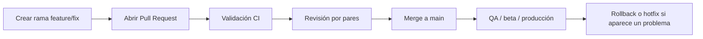

# Workflow de versionado y estrategia de despliegue móvil

## 1. Introducción

En el contexto de un proyecto de desarrollo móvil orientado a la gestión de reportes ciudadanos, la adopción de un flujo de trabajo de control de versiones claro y una estrategia de despliegue segura son factores determinantes para garantizar calidad, trazabilidad y reducción de riesgos. El desarrollo colaborativo exige un modelo que permita trabajar en paralelo sin afectar la rama principal del proyecto, al mismo tiempo que facilite validaciones automáticas, revisiones formales y entregas controladas.

Para este caso de estudio, se recomienda el uso de GitHub Flow como modelo base, ya que combina simplicidad, rapidez de implementación y un nivel de control apropiado para equipos pequeños o medianos que trabajan sobre una aplicación móvil con entregas iterativas.

## 2. Elección del workflow de trabajo

### 2.1 GitHub Flow

GitHub Flow es un flujo de trabajo ligero basado en una rama principal, normalmente `main`, y en Pull Requests para integrar cambios. Permite mantener la rama maestra estable y hacer cambios de forma aislada en ramas temporales como `feature/*`, `fix/*` o `chore/*`.

### 2.2 Comparación con otros enfoques

- GitHub Flow: resulta ideal para equipos que priorizan velocidad, simplicidad y revisión de cambios continuos. Es muy útil cuando el proyecto tiene un único eje de desarrollo y entregas frecuentes.
- Gitflow: es más robusto para organizaciones con múltiples líneas de trabajo simultáneas, pero introduce mayor complejidad por la presencia de ramas `develop`, `release`, `feature` y `hotfix`.
- Trunk-Based Development: se centra en integración continua y ramas cortas, pero exige una disciplina muy alta de merge continuo y validación automática casi inmediata.

### 2.3 Justificación para el proyecto

El proyecto móvil de Mejora SJR tiene un alcance manejable, una rama principal que debe mantenerse estable y un ciclo de desarrollo en el que las funcionalidades se entregan mediante PRs revisados. Por ello, GitHub Flow es la opción más apropiada: mantiene la base de código ordenada, favorece la trazabilidad de los cambios y permite integrar validaciones automatizadas antes de pasar a producción.

### 2.4 Diagrama del flujo

## 3. Gobernanza del repositorio

Para mantener la integridad del repositorio, se recomienda aplicar las siguientes políticas en GitHub:

- Rama principal protegida: `main`.
- Requerir Pull Request antes de cada merge.
- Exigir al menos una aprobación del código antes de fusionar.
- Exigir que los checks del CI estén en verde antes del merge.
- Bloquear push directo a `main`.
- Mantener una plantilla estándar de Pull Request para homogeneizar la información del cambio.

Estas reglas permiten controlar la calidad del código, asegurar revisión por pares y limitar el riesgo de introducir regresiones o cambios no validados.

## 4. Convención de commits y versionado

### 4.1 Convención de commits

Se recomienda utilizar Conventional Commits para mantener un historial legible y consistente:

- `feat:` para nuevas funcionalidades.
- `fix:` para correcciones.
- `chore:` para tareas de mantenimiento.
- `docs:` para documentación.
- `refactor:` para mejoras internas del código.

Ejemplos:

- `feat: agrega validación de login`
- `fix: corrige error en carga de reportes`
- `docs: añade estrategia de despliegue`
- `chore: configura pipeline de CI`

### 4.2 Versionado

El proyecto debe seguir un esquema semántico de versionado:

- `vX.Y.Z`
- `X`: cambios mayores o incompatibles.
- `Y`: nuevas funcionalidades.
- `Z`: correcciones y parches.

Además, debe existir un seguimiento del número de compilación interno de la aplicación móvil para reforzar trazabilidad entre el código, el artefacto entregado y la versión publicada.

## 5. Pipeline de Integración Continua (CI)

La integración continua debe ejecutarse en cada Pull Request dirigido a `main` y validar al menos los siguientes puntos:

- instalación correcta de dependencias,
- ejecución de pruebas unitarias,
- validación de tipos,
- compilación o build mínimo,
- detección de errores de sintaxis.

En este proyecto, la mejor alternativa es un pipeline sencillo y automatizado para la app móvil, con una configuración mínima pero efectiva. Esto permite que cada cambio que llegue a la rama principal haya sido validado técnicamente por el sistema antes del merge.

### 5.1 Resultado esperado

La intención es garantizar que:

- el proyecto siga compilando,
- los cambios no rompen lógica ya existente,
- el equipo detecte errores temprano,
- la integración en `main` se vuelva más segura y predecible.

## 6. Estrategia de despliegue móvil

Para una aplicación móvil, la estrategia de despliegue debe equilibrar velocidad, riesgo y estabilidad. En este caso, la mejor opción es un enfoque de despliegue escalonado o canario con un canal de pruebas previo.

### 6.1 Estrategia recomendada

1. Publicar la versión candidata en un entorno de prueba o beta.
2. Validar funcionalidad y rendimiento en un número limitado de usuarios o dispositivos.
3. Incrementar progresivamente el porcentaje de usuarios destinatarios.
4. Monitorear métricas clave durante la liberación.
5. Promover la versión al 100% una vez se confirmen resultados positivos.

### 6.2 Beneficios de esta estrategia

- reduce el impacto de errores críticos,
- permite evaluar estabilidad real antes del despliegue completo,
- facilita la detección temprana de regresiones,
- mejora la confianza del equipo y de los usuarios finales.

### 6.3 Estrategia de contingencia

Además del despliegue gradual, se recomienda complementar con mecanismos de reversión:

- Feature Flags para activar o desactivar funcionalidades sin publicar una nueva versión completa.
- Rollback de la versión en caso de un problema crítico.
- Cancelación del rollout si las métricas de estabilidad empeoran.
- Hotfix inmediato para corregir fallos severos en producción.

## 7. Métricas de estabilidad y criterios de avance

Durante cualquier liberación de una aplicación móvil es necesario definir métricas claras para decidir si la versión puede avanzar o debe detenerse.

### 7.1 Métricas recomendadas

- tasa de usuarios sin crashes mayor a 99.5%,
- tasa de errores de red por sesión,
- tasa de desinstalación,
- tasa de fallo en autenticación o carga de reportes,
- porcentaje de usuarios que completan el flujo principal sin errores.

### 7.2 Criterios de avance

La versión puede continuar si:

- no se detectan errores críticos en QA,
- las pruebas automatizadas pasan correctamente,
- la estabilidad del flujo principal es aceptable,
- el número de fallos no supera el umbral definido por el equipo.

### 7.3 Criterios de reversión

Debe considerarse la reversión si:

- aumenta la tasa de crashes de forma sostenida,
- aparecen fallos en autenticación o en el flujo principal,
- el porcentaje de desinstalación supera el límite aceptado,
- la regresión afecta una funcionalidad crítica para el usuario.

## 8. Recomendación final

Para este proyecto, la combinación más equilibrada es:

- GitHub Flow como flujo principal de trabajo,
- ramas protegidas y Pull Requests obligatorios,
- validación automática en cada PR,
- control de versiones semántico,
- despliegue gradual con beta/canary,
- Feature Flags y plan de rollback documentado.

Este enfoque minimiza riesgos, mejora la calidad del desarrollo y permite entregar valor de manera continua sin comprometer la estabilidad de la aplicación móvil.

## 9. Conclusión

La administración correcta del repositorio y la estrategia de despliegue no son simplemente prácticas de organización; son elementos fundamentales para asegurar la sostenibilidad del proyecto. Un flujo de trabajo claro, una política de revisión definida y una validación automática ayudan a prevenir errores, reducir retrabajos y mantener la confianza del equipo.

La implementación de una estrategia de despliegue móvil controlada y gradual es crucial para proteger a los usuarios y asegurar que cada nueva entrega responda a estándares mínimos de calidad. En conjunto, estas decisiones convierten el desarrollo móvil en un proceso más disciplinado, eficiente y confiable.
